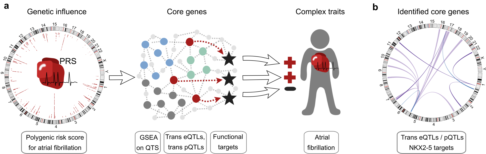

```{r setup, include=FALSE}
knitr::opts_chunk$set(echo = TRUE)
```

# Summary

This is a short summary of our polygenic risk score (PRS) based pathway enrichment approach to preselect candidate genes for trans QTL analyses.

You can find a preprint version of the manuscript  
Ines Assum & Julia Krause et al., Tissue-specific multiOMICs analysis of atrial fibrillation, *bioRxiv* (2020)  
here:
https://doi.org/10.1101/2020.04.06.021527

We address a key hypothesis about the existence of core genes as postulated in the omnigenic model by [Liu et al.](https://doi.org/10.1016/j.cell.2019.04.014), *Cell* (2019). Core genes are central genes with trans-associations to GWAS loci, whose expression levels directly affect a disease phenotype. Here we sought to identify candidate core genes for AF to understand the contribution of trans-genetic effects in the pathology of AF. To prioritize genes satisfying the properties predicted by the omnigenic model, we evaluated the accumulation of trans-effects, their relevance in gene regulatory networks, and the disease association by the following strategy:


(Overview figure of our approach)


i) Evaluate cumulated trans-effects of disease-associated variants on expression by ranking genes based on their correlation of mRNA and protein abundance with a PRS (eQTS) as proposed by [Võsa et al.](https://doi.org/10.1101/447367), *bioRxiv* (2018)

ii) Identify genes sharing molecular function and representing biological networks that propagate genetic trans-effects to core genes by pathway enrichment analysis (GSEA) on the eQTS rankings. Genes driving the enrichment of multiple gene sets were selected as core gene candidates.

iii) Establish the link between the core gene candidates and the disease based on a significant trans eQTL GWAS hit.


# Example

In the following, we show the general procedure based on public data (1000 genomes LCL data).  
We supply a small test dataset with pre-computed PRS values. Additionally, we need to get expression data.
```{r}
if (!file.exists("E-GEUV-1_expression.RDS")) {
  efile <- "E-GEUV-1_tpms.tsv"
  if (!file.exists(efile)) {
    download.file(
      paste0("https://www.ebi.ac.uk/gxa/experiments-content/E-GEUV-1/resources/ExperimentDownloadSupplier.RnaSeqBaseline/tpms.tsv"),
      dest=efile
      )
  }
  expr <- read.csv(efile, sep = "\t", skip = 4, stringsAsFactors = F)
  colnames(expr) <- gsub("^[^_]*\\.\\.", "", colnames(expr))
  expr <- expr[!duplicated(expr$Gene.Name), ]
  rownames(expr) <- expr$Gene.Name
  expr[, c("Gene.ID", "Gene.Name")] <- NULL
  
  prs <- read.csv(file="1kPhase3_PRS.txt",
                  sep = "\t", h = T, stringsAsFactors = F)
  rownames(prs) <- prs$id
  expr <- data.frame(t(expr[, which(colnames(expr) %in% prs$id)]),
                     stringsAsFactors = F)
  expr <- expr[, which(colSums(is.na(expr))==0)]
  expr <- log(expr+1)
  med <- apply(expr, 2, median)
  expr <- expr[, names(med[which(log(med+1)>1)])]
  test <- apply(expr, 2, var)
  expr <- expr[, which(test>0.2)]
  expr <- expr[, which(apply(expr, 2, var)<1)]
  saveRDS(expr, file = "E-GEUV-1_expression.RDS")
  unlink(efile)
} else {
  expr <- readRDS("E-GEUV-1_expression.RDS")
}
```


First step is to calculate the eQTS rankings:
```{r}


```


```{r}

```

